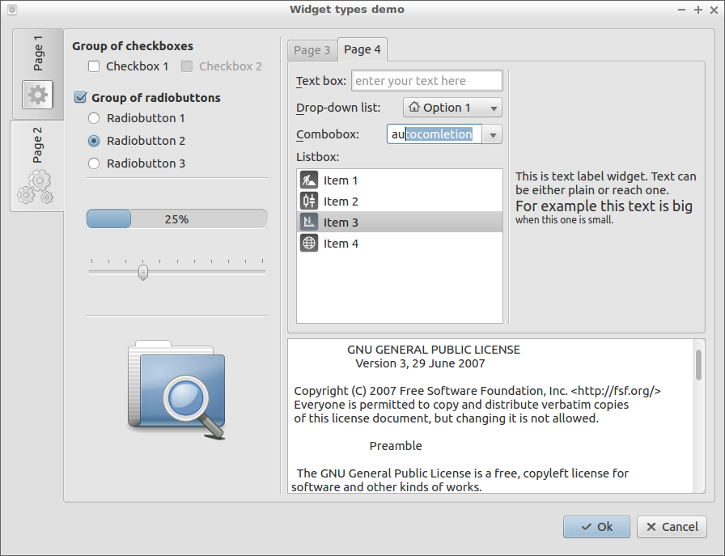

Copyright (C) 2015, 2016 Andriy Martynets [andy.martynets@gmail.com](mailto:andy.martynets@gmail.com)<br>
See end of this file for [license conditions](#license).

-------------------------------------------------------------------------------
#### Сontents
- [Introduction](#introduction)
- [Software Requirements](#software-requirements)
- [Downloading](#downloading)
- [Installation](#installation)
- [Usage](#usage)
- [Widgets](#widgets)
- [Layouts](#layouts)
- [Commands](#commands)
	- [Commands syntax and description](#commands-syntax-and-description)
- [Invocations](#invocations)
	- [Case 1: User accepts or rejects the dialog box](#case-1-user-accepts-or-rejects-the-dialog-box)
	- [Case 2: User enters data and accepts the dialog](#case-2-user-enters-data-and-accepts-the-dialog)
	- [Case 3: User input requires the dialog box to be modified (pipes)](#case-3-user-input-requires-the-dialog-box-to-be-modified-pipes)
	- [Case 4: User input requires the dialog box to be modified (FIFOs)](#case-4-user-input-requires-the-dialog-box-to-be-modified-fifos)
	- [Case 5: Manage a background process with GUI frontend](#case-5-manage-a-background-process-with-gui-frontend)
- [Examples](#examples)
- [Bug Reporting](#bug-reporting)
- [Change Log](#change-log)
- [License](#license)

-------------------------------------------------------------------------------

#### Introduction
The `dialogbox` application is a scriptable engine which provides a fully customizable GUI dialod box with various widgets. The desired dialog box is built and modified by commands read on the standard input when the end-user actions are reported on standard output. It implements the idea of a `GUI <-> text` filter tool.

The main purpose of this application is to provide GUI functionality to shell scripts or any other pure console applications capable to communicate with a child process via its standard input/output.

This is a Qt application and it introduces all the power of Qt to shell scripts from command buttons through stylesheets and animations.

#### Software Requirements
This application was designed for Qt 4.8, but the new versions will be using the Qt 5 library. It must be portable across systems supported by the Qt libraries, but the author tested it in GNU/Linux environment only.

To compile the application from the source code the following packages must also be installed on a GNU/Linux system - build-time dependencies:
- g++
- make
- qtbase5-dev

#### Downloading
The latest released version of the `dialogbox` application can be checked by the link below:

https://github.com/martynets/dialogbox/releases/latest

Current development version can be downloaded using the following link:

https://github.com/martynets/dialogbox/archive/master.zip

The `dialogbox` project is also available via Git access from the GitHub server:

https://github.com/martynets/dialogbox.git

#### Installation
To compile and install the application issue the following commands from the source directory:
```
qmake
make
make install
```
> Note: the application is installed in `/usr/bin` directory and thus the last one command requires root privileges

If you want to make sure that it compiles using Qt5 libraries, select it as the default.
```
export QT_SELECT=qt5
```

To uninstall the application issue the following command from the same directory (the same note is applicable here):
```
make uninstall
```
#### Usage
The application reads commands on its standard input, builds and modifies the dialog box based on the commands provided, interacts with the end-user and reports the user's actions on the standard output and by the exit status. The dialog box can be either accepted or rejected by the user. This is reflected by the exit status of the application. If the user accepts the dialog box all reportable enabled named widgets are reported to the standard output by pairs `<widget_name>=<value>`, one per line. The same output can also be produced on demand by `query` command.

Pushbuttons (command buttons) are reported immediately once they are clicked in form `<pushbutton_name>=clicked`. A pushbutton can have `exit` option set. In this case clicking it terminates the application with rejected status. It can also have `apply` option set. Clicking it in this case produses output for accepted dialog described above. Clicking a pushbutton with both these options set terminates the application with accepted status. This is the only way to accept the dialog box. Closing the application using the Window Manager's controls or pressing `Esc` key rejects the dialog box.

Toggle pushbutton (one with `checkable` option set) is reported as `<pushbutton_name>=pressed` or `<pushbutton_name>=released` immediately once it gets toggled.

Next, there are limited cases when widgets are reported immediately to allow the dialog box modifications to be made in response to the end-user actions. These are the following:
- item selection in a list widget (either list box, drop-down list or combobox) with `selection` option set;
- item activation (double click or `Enter` key press) in a list box with `activation` option set;
- a slider move;

In all these cases widgets are reported in form `<widget_name>=<value>`.

The application recognizes several command line options. The command line syntax is the following:
```
dialogbox  [OPTIONS]
```
Options recognized are the [standard Qt options](http://doc.qt.io/qt-4.8/qapplication.html#QApplication) and the application specific ones described below:

|Option         |Action                                             |
|---------------|---------------------------------------------------|
|-h, --help     |display brief usage information and exit           |
|-v, --version  |display version information and exit               |
|-r, --resizable|make the dialog resizable                          |
|-d, --hidden   |don't show the dialog until explicit 'show' command|

By default the dialog box has fixed size based on recommended sizes of widgets drawn on it. The `--resizable` option changes this and makes the main window resizable using either the Window Manager's controls or special size grip control placed in the bottom right corner.

The `--hidden` option makes the dialog box invisible until explicitly instructed by the `show` command. Use of this option is strongly advised as it prevents continuous flicker while the dialog box is built. Once the dialog box is built it can be presented to the end user by `show` command. This technique improves the end-user experience. By default the dialog box is shown to prevent confusion when the script misses the `show` command or the application is run interactively and shows the about dialog.

##### Values of exit status mean the following:
- 0 - success (`--help` or `--version` only)
- 0 - user rejected the dialog (closed the window using the WM controls, pressed `Esc` key or clicked a pushbutton with `exit` option set and `apply` option unset)
- 1 - user accepted the dialog (clicked a pushbutton with both `apply` and `exit` options set)

#### Widgets
Widgets or controls can be classified using different criteria. In this document the following terms are used:
- Container widget - a widget which hosts a layout either horizontal or vertical and child widgets or hosts full structure of layouts (see [Layouts](#layouts) section below) and child widgets including container ones forming nested structure. The former case is groupbox and frame when latter one is dialog and page widget types.
- Joint widget - a paired widget which is formed by a text label and a control which actually provides the functionality. Textbox, combobox, dropdownlist and listbox are widget types of this kind.
- Composite widget - a widget with sub-controls such as drop-down button or scroll bar. Examples of such type of widgets are combobox, listbox, etc.
- Reportable widget - a widget which provides means to either edit a value or select a value. The value edited or selected by the end-user is reported.
- List widget - a widget which either is a list or has a subcontrol of list and supports adding items to it. Current version of the application supports the following types of list widgets: listbox, dropdownlist and combobox. All of them are joint widgets as they consists of title label and the main functional widget which in turn is a composit widget.

Current version of the `dialogbox` supports the following widget types:
- **checkbox** (tick box) - a control which can be toggled by mouse click or `Space` key press to make it checked or unchecked. That indicates the option the control represents is either on or off. This control has `title` (or `text`), `icon` and `checked` options which can be set.
A checkbox is reportable and its value is reported as `1` if checked and as `0` if unchecked.

	>Note: the icon for this control is an extra icon for the text label. Don't mix it with the check mark icon. To customize the latter use stylesheets.

- **combobox** - a kind of textbox widget type with drop-down list of predefined values available for selection as edited text. By its look and design this type of widget is similar to dropdownlist type but by its nature it is close to textbox widget type. Here the end-user edits a text string with its autocompletion from the list of predefined values or selects initial value from the list and edits it. A widget of this type has `title`, `text` and `selection` options. This is joint widget type. The title is a text label in front of the edit field. The latter in turn is a kind of composit widget built-up of a set of sub-controls. The list is populated with items - widgets of type item, see below. The text is the value being edited in the edit field. The end-user can select the initial text by choosing one of the items using mouse or navigation keys when the widget is in the keyboard focus. Navigation keys scroll items from the list when `F4` key drops the list down. Alternatively the end-user may start typing and the text will be autocompleted with a value from the list that matches typing. With `selection` option set the combobox widget is reported immediately with value of the text of selected item.
Combobox widget is reportable. The edited text is the reported value.

- **dialog** - the main window. This is container widget, a kind of page widget, see below. Only one instance of widget of this type is supported by the application and it is created automatically when the application starts. It has `title` (or `text`) and `icon` options which are the decoration of the main window. It has no name and all possible actions are taken on it by commands with omitted name.
This widget is not reportable.

- **dropdownlist** - a one line control showing option selected from drop-down list of possible options. By its look and design this type of widget is similar to combobox type but by its nature it is close to a group of radiobuttons. Here the end-user is offered a list of options when only one of them can be selected at a time. A widget of this type has `title` (or `text`) and `selection` options. This is joint widget type. The title is a text label in front of the drop-down list. The latter in turn is a kind of composit widget built-up of a set of sub-controls. The list is populated with items - widgets of type item, see below. The end-user can select one of the items using mouse or navigation keys when the widget is in the keyboard focus. Navigation keys scroll items from the list when `Space` and `F4` keys drop the list down. The selected item becomes the current one. With `selection` option set the dropdownlist widget is reported immediately with value of the text of selected item.
Dropdownlist widget is reportable. The text of current item is the reported value.

- **frame** - a container widget which provides a rectangular area and hosts layout of either `horizontal` (default) or `vertical` type which manages sizing and positioning of child widgets. See [Layouts](#layouts) section below. The rectangular area can have different shape and be drawn by line of different type of shadow. The shape could be either `box`, `panel` or `styled` panel or could have `noframe` at all. The box shape draws line border around the content. The panel and styled panel are drawn as raised or sunken areas. The styled panel look depends on the current GUI style. The line could be either `plain`, `raised` or `sunken` shadow types. By default frame uses plain type of line and has no frame - draws nothing.
Frame widget is not reportable.

- **groupbox** - a container widget which provides visual separation and groupping of another widgets. It might have border or be flat depending on current GUI style/theme. Optionally this control can have `title` (or `text`) and can be `checkable` (has checkbox sub-control) with `checked` option. All these options head the group of child widgets. If groupbox is checkable and is unchecked all child widgets are disabled. Widgets of this type similarly to frame widgets host layout of either `horizontal` (default) or `vertical` type.
Only checkable groupbox is reportable. In this case value of groupbox widget is reported as `1` if it is checked and as `0` otherwise.

- **item** - is a pseudo widget type. It is introduced to unify list widgets concept and commands syntax. This type does not refer to a real widget but describes an item of a list widget. The latter can be either listbox, dropdownlist or combobox. Each item has `text` (or `title`) and `icon` options and can be made `current` in its list. Items have no own names but are referred to using the list widget's name and the item number or text (see [Commands](#commands) section below).
As items are not real widgets they are not reportable.

- **label** - an informative control displaying content of either `text`, `picture` or `animation` type. For `text` content both plain and reach text formats can be used. As the `picture` an image file in one of the following formats can be used:

	|Format|Description                     |
	|------|--------------------------------|
	|BMP   |Windows Bitmap                  |
	|GIF   |Graphic Interchange Format      |
	|JPG   |Joint Photographic Experts Group|
	|JPEG  |Joint Photographic Experts Group|
	|PNG   |Portable Network Graphics       |
	|PBM   |Portable Bitmap                 |
	|PGM   |Portable Graymap                |
	|PPM   |Portable Pixmap                 |
	|XBM   |X11 Bitmap                      |
	|XPM   |X11 Pixmap                      |

	The `animation` is also a file in either Animated GIF or Multiple-image Network Graphics (MNG) format.
Label widget alters its parent layout alignment. Text label sets it to the default which depends on the type of the layout. Picture and animation labels set the alignment to centered in both directions. This could confuse if another widgets are added to the same layout. It is advised to keep picture and animation labels on separate layouts.
Label widgets also set their own alignment within the parent layout. The same, picture and animation labels are centered when text labels are aligned top-left which is the default for widgets.
Label widget is not reportable.
- **listbox** - a scrollable list of items available for selection or activation. A widget of this type has `title` (or `text`), `selection` and `activation` options. This is joint widget type. The title is a text label on top to name the list. The latter in turn is a kind of composit widget built-up of a set of sub-controls. The list is populated with items - widgets of type item, see above. The end-user can select one of the items using mouse or navigation keys when the widget is in the keyboard focus. The selected item becomes the current one. With `selection` option set the listbox widget is reported immediately with value of the text of selected item. With `activation` option set the widget is also immediately reported in the same way in response to the item activation. The item is activated in way the current desktop environment is configured for. Usually this is double click by mouse or `Enter` key press.
Listbox widget is reportable. The text of current item is the reported value.

	>Note: when keyboard focus is on a listbox widget with `activation` option set the latter processes `Enter` key press event and it is not propagated to default/autodefault pushbutton. When the option is unset the `Enter` key press event is propagated and triggers the default/autodefault pushbutton.

- **page** - this is container widget type. It is not actually drawn on the screen but hosts whole structure of layouts and child widgets supported by the application (see [Layouts](#layouts) section below). The root page is the dialog box itself. It is placed on the main window. The rest pages are added to tabs widgets. The latter ones are added to some pages, thus are stacked and form 3D structure of the dialog box. Each page can have `title` (or `text`) and `icon` and can be set `current` for the host tabs widget.
Widgets of this type are not reportable.

- **progressbar** - a bar like control which provides end-user with graphical representation of progress of a long-run process. The bar can be either `horizontal` (default) or `vertical` orientation. It can be set `busy` mode when it shows only running bar. This is useful in cases when it is impossible to calculate percentage (say, total amount is unknown). By default widget of this type shows percentage and, depending on GUI style, additionally draws text with number of percents completed. A widget of this type has `minimum`, `maximum` and `value` options. These values are used to calculate the percentage: (`value`-`minimum`)/(`maximum`-`minimum`). Seting `value` updates the progress. The `minimum` defaults to 0, and `maximum` to 100. With these defaults the `value` is the percentage. If `value` is set below `minimum` or above `maximum` it is adjusted automatically. Setting both `minimum` and `maximum` to 0 switches the widget to busy mode and vice versa.
Progressbar widget is not reportable.

- **pushbutton** (command button) - a control which can be pressed (by mouse click or by `Space` or `Enter` keys press when keyboard focus is on it) to initiate an action. It has several options which can be set to customise its look and behaviour: `title` (or `text`), `icon`, `exit`, `apply`, `default`, `checkable` and `checked`. The `title` (`text`) and `icon` are drawn on the button. The `exit` and `apply` options define the rejection and acceptance of the dialog box and are described in [Usage](#usage) section above. One of the pushbuttons within the dialog box can be set as the default one. That means it is pressed once the end-user hits `Enter` key when keyboard focus is on a widget of another type.
A special type of pushbutton is toggle pushbutton. This is one with `checkable` option set. Pressing it toggles it between pressed and released states which correspond to `checked` option's set and unset states.
Pushbutton widgets are reported immediately as they are pressed with value of `clicked`. Toggle pushbuttons are reported in the same way but with values of either `pressed` or `released` depending on their state.
A toggle pushbutton is reportable and its `checked` state is reported as `1` if pressed or as `0` if released.

- **radiobutton** - a selectable control to select an option represented by it within group of similar controls that represent alternative options. These controls are used by groups to represent a selection of options when only one of them is possible at a time. It can be selected by mouse click or by navigation keys when the keyboard focus is on the group. As the previous control type this one has `title` (or `text`), `icon` and `checked` options which can be set.
This is reportable widget type. Value of radiobutton widget is reported as `1` if it is the selected one and as `0` if it is not.
- **separator** - a decorative control which forms a border to split the dialog box into logical areas. The control is a line either `horizontal` (default) or `vertical` orientation. It could be either `plain`, `raised` or `sunken` shadow types. The latter is used by default.
Separator widget is not reportable.

	>Note: separator widget is fully shrinkable and as the result a vertical separator has zero height on vertical layout if the latter contains more widgets. The same is true for length of horizontal separator on a horizontal layout with more widgets. To make them visible use them solely on separate layouts of the same orientation or use vertical separators on horizontal layouts and horizontal separators on vertical layouts depending on design of the dialog box.

- **slider** - a control which consists of a bar that represents a range of values and movable handle which position selects the value. This type of widget alows end-user to select a value within the given range. This is composit widget with sub-controls. The bar can be either `horizontal` (default) or `vertical` orientation. A widget of this type has `minimum`, `maximum` and `value` options. The `minimum` defaults to 0, and `maximum` to 100. If `value` is set below `minimum` or above `maximum` it is adjusted automatically. The slider handle can be moved by either mouse click, drag and drop or scroll or by keyboard navigation keys. Widget of this type is reported immediately once the `value` changes. This alows to adjust the dialog box once the end-user selects a new value.
Slider widget is reportable. It is reported with current `value`.

- **tabs** - a control which provides means to select and show stackable pages within single frame. For selection a bar of tabs (labels) provided. The bar can be located on `top`, `bottom`, `left` or `right` side of the frame. Tabs are added to the widget as pages, see page widget type above. As page hosts full structure of layouts it may host also a tabs widgets and thus they might get nested. Tabs widget is a kind of composit widget as it consists of sub-controls. Pages selection is done by tabs selection which in turn can be done by mouse click or scroll or by keyboard navigation keys if the widget is in keyboard focus. Keyboard tabbing may be confusing if pages/tabs widgets are nested. The keyboard focus moves between widgets on the same page first (starting from the root page - the dialog) and after full cycle jumps into the page of the current tab of the tabs widget on this level. Next it moves between widgets on that page and so on.
Tabs widget is not reportable.

- **textbox** (line edit, edit field) - a one line text edit control. A widget of this type has `title`, `text`, `placeholder` text and `password` options. This is joint widget type. The title is a text label in front to name the value edited. The text is the value edited itself. The placeholder is a hint text shown instead of empty text. The password option is a flag which instructs the control to hide the value entered showing asterisks instead of the characters.
This is reportable widget type. The text entered by the end-user is the reported value.
- **textview** - a control which provides means to scroll and view a text file which name is provided. It supports two formats of text files: plain text and HTML formatted text. In latter case only formatted text is presented. No rich content is supported, no navigation means provided. It is intended to present to the end-user a simple textual information (e.g. manual, license, etc.). This is composit widget with sub-controls.
Textview widget is not reportable.

	>Tip: in most cases width (and probably height) of the textview widget doesn't suit to view the file. To adjust font and size settings of the widget set its stylesheet with settings similar to the following:
	>`QTextEdit {font-family: monospace; min-width:41em;}`
	>see `set stylesheet` command below.

For better widgets positioning two types of spacer items are supported:
- **stretch** - locates free space available within the layout

	>Note: a stretch is noticeable only if there is free space available on the layout. This can be a case if the vertical layout has higher neighbor or the horizontal one has broader neighbor.

- **space** - adds extra space in pixels

Navigation between widgets can be done using a pointing device (e.g. mouse) or by keyboard. The latter way consists of tabbing and shortcuts. The tabbing order is setup based on widgets position withing a layout and layouts within the main window. Text labels are included into the tabbing chain by default as they might contain links - navigation controls.

>Tip: to exclude a text label from the tabbing order set its stylesheet with the following property:
>`qproperty-textInteractionFlags: NoTextInteraction;`

Keyboard shortcuts can be added to widgets by preceding a desired character with ampersand symbol in the widget's title. The character then is displayed underlined. Pressing keyboard combination `Alt-<character>` moves input focus to that widget.

>Tip: use `&&` to display an actual ampersand.

Widgets can be created (added), removed, enabled/disabled, shown/hidden, styled and set with appropriate values and decorations. See [Commands](#commands) section below. All actions taken on widgets are done using their names which are optionally setup when widgets are added.

> Note: if a widget misses name it can not be modified, removed or reported.
> Only enabled widgets are reported.

Some commands that modify existing widgets can be used without widget name specified. In this case they are addressed to the whole dialog box (dialog widget - the root page) and affect either the main window or all widgets at once.

Widgets can be styled using stylesheets. This technic allows to customize spacing, sizing, colors, background, fonts, images, etc. for widgets and their sub-controls. Stylesheets can be setup for a particular widget, group of widgets (container widget), class of widgets and all widgets as a whole including main window. See [Qt Style Sheet](http://doc.qt.io/qt-4.8/stylesheet-syntax.html) for more information.

Below screenshot demonstrates supported widget types:



#### Layouts
Complex dialog box design is based on nested layouts structure. Layouts are responsible for positioning and sizing of their child objects. Horizontal layouts position their objects from left to right when vertical layouts from top to bottom. Combination of horizontal and vertical layouts allows to freely position and logically group any widgets to create desired dialog box.

The `dialogbox` application maintains three level layouts structure. It consists of main vertical layout which hosts horizontal layouts which in turn host the final third level of vertical layouts. Only the last one hosts widgets. Initially there is only one layout on each level. On demand they are added on the third and on the second levels. One of the third level layouts is the current one. That is the layout where widgets are added.

Widgets are added as a column. When there is a need to add new controls at a side, the application does "horizontal step" by adding new vertical layout on the third level and makes it the current one. To start new composition of widgets below the application does "vertical step" by adding new horizontal layout on the second level with single vertical layout on the third level which becomes the current one. And so forth.

To summarize, the main layout, level 1, is to support move vertically, horizontal layouts, level 2, are to support move horizontally and the level 3 is to host target widgets.

The described above nested structure of layouts is created by only two commands: `step horizontal` and `step vertical`. Additionally `position` command is supported to change the current layout.

>Note: empty layout (containing nothing except spacer items) is removed automatically as soon as it loses focus (is no longer the current one).

Container widgets (groupbox, frame) can host own layout either vertical or horizontal. Adding such a widget makes its layout the current one and subsequent new widgets are added to it. The `end` command finishes this process and returns focus to the third level layout. Also the process is finished by commands that move the focus: `step` and `position`. Adding new container widget or positioning onto such one switches the process to the latter.

Layouts are aligned within their parents in default way, which depends on the type of the parent layout. The exception is layouts which contain a picture or animation label. Such a widget changes the alignment to centered in both directions. Change of its type to text restores the default alignment.

>Note: there are alignment of a layout within its parent layout, alignment of a widget within its hosting layout and alignment of a content within widget. Here the alignment of layouts is discussed.

Below chart demonstrates example structure of layouts for a dialog:


Next sequence of meta commands builds a dialog box with the above structure:
```
add widget1
add widget2
step horizontal
add widget3
step vertical
add frame widget4
add stretch
add widget5
add widget6
end frame
add widget7
```
A real example with the above structure might look the following:


The described above means allow to position widgets horizontally and vertically forming 2D page. The `dialogbox` application is capable to maintain multiple pages which are stacked resulting in 3D structure of widgets. The root page is the dialog box itself and it is created automatically. Extra pages can be added to tabs widgets forming their pages. As each page repeats whole structure of layouts it can host tabs widgets with their pages on next level. To manage this complex structure the same commands used. Adding a tabs widget makes it current one. This means that subsequent pages will be added to it. This does not change current page and layout. The tabs widget's host page and layout remain the current ones and any actions requested will be performed on them (adding layouts or widgets, except page). Adding a page will add it to the current tabs widget and make it and its layout the current ones. Now all subsequent `add` and `step` commands will operate on them. Adding one more page switches to it. Command `end page` closes the current one page and moves focus to its host tabs widget hosting page and layout. Command `end tabs` moves focus behind it making its host page and layout the current ones and makes the tabs widget one level up the current one, if any. Command `position` allows freely change current page and tabs widget. Positioning to a widget makes its host page and tabs widget the current ones. It's important to distinguish between positioning to a page or a tabs widget and positioning onto a page or a tabs widget. Positioning onto a page makes it, its hosted layout and its host tabs widget the current ones. Positioning to a page or onto a tabs widget makes the latter and its host page/layout the current ones. Position to a tabs widget makes its host page/layout and tabs widget (if any) the current ones. See `position` command below for more details.

Below sequence of meta commands builds a dialog box with nested tabs widgets:
```
add tabs widget1
add page widget2
add widget3
add page widget4
add tabs widget5
add page widget6
add widget7
add page widget8
add widget9
add widget10
step horizontal
add widget11
end tabs
end tabs
add frame widget12
add stretch
add widget13
add widget14
end frame
```
A real example built by the above commands might look the following:


#### Commands
The `dialogbox` reads commands from its standard input. Each command consists of one or more tokens. It is started by a token of action followed by optional tokens of type/name/options and is ended by next command, end of line or end of file. A command can be continued on next line if the end of line is escaped by back slash character (`\`). Commands are recognized on the best efforts basis which means the application does what it understood. Everything that wasn't understood is silently ignored.

Tokens are separated by whitespaces. If a token contains a white space character (including new line) it must be quoted by double quote characters (`"`). To use double quote character within a token (either quoted or not) the former must be escaped by back slash character (`\`).

>Note: back slash character is interpreted specially only in two cases mentioned above. In all the rest cases it is interpreted literally.

Tokens can be either keywords (reserved words) or custom strings. The latter are used to define widgets' name, title, text and auxiliary text depending on command. Keywords are used to define commands themselves, widget types and options available. Tokens are case sensitive and keywords are always lowercase. Using keywords in positions where custom strings are expected is ill-advised and may lead to unpredictable results.

Below table lists keywords reserved by current version of the `dialogbox` application:

|Commands|Controls    |Options   |Options    |
|--------|------------|----------|-----------|
|add     |checkbox    |activation|minimum    |
|clear   |combobox    |animation |noframe    |
|disable |dropdownlist|apply     |onto       |
|enable  |frame       |behind    |panel      |
|end     |groupbox    |bottom    |password   |
|hide    |item        |box       |picture    |
|position|label       |busy      |placeholder|
|query   |listbox     |checkable |plain      |
|remove  |page        |checked   |raised     |
|set     |progressbar |current   |right      |
|show    |pushbutton  |default   |selection  |
|step    |radiobutton |enabled   |styled     |
|unset   |separator   |exit      |stylesheet |
|        |slider      |file      |sunken     |
|        |space       |focus     |text       |
|        |stretch     |horizontal|title      |
|        |tabs        |icon      |top        |
|        |textbox     |iconsize  |value      |
|        |textview    |left      |vertical   |
|        |            |maximum   |visible    |

>Note: for each command total size of all custom strings plus size of last token if it is a keyword should not exceed 1024 bytes. This includes terminating zeros for each of these tokens.

Majority of commands expect a widget name as one of its arguments. Some of them assume the whole dialog box as the widget if no name provided. The name is given to the widget when it is created and is used in further commands to refer to it. The name must be unique and can be any token except the keywords listed above. Also name must not contain symbols hash `#` and colon `:`. These two have special meaning in names and are used to address items in list widgets. An item can be addressed in one of two ways: as `<list_widget_name>#<item_number>` or as `<list_widget_name>:<item_text>`. The item number is decimal number started from 0. The item text is the exact text as it was set for the item.

##### Commands syntax and description:

- **`add type [title] [name] [options] [text] [auxtext]`** - adds a control of type `type` at current position. Normally current position is bottom of current layout (see [Layouts](#layouts) section above). This can be changed by `position` command. The rest arguments of the command are optional and vary depending on the type of the control. For any type of widget, `name`, if provided, is an unique identifier for the added widget and is used to refer to it in subsequent commands as well as to report its value.

	>Note: `title`, `name`, `text` and `auxtext` are custom strings and are expected in this order. This means that the first custom string is assumed to be the `title`, the second one to be the `name` and so on. If you want to omit `title`  put empty string `""` in its position otherwise the `name` will be accepted as the `title`. `options` is one or more keywords specific for a particular widget type. They can be used in any combination and in any order. Once any `options` keyword is recognized the parser treats the rest of custom strings as `text` and `auxtext`. The latters can precede some or all `options` and in some cases below are show there and named specifically for better reading.

	- `add checkbox [title] [name] [options]`
		`title` - text used on the checkbox widget.
        `options` - optional `checked` keyword which makes the checkbox checked.
	- `add combobox [title] [name] [options]` - starts list widget. Subsequent `add item` commands will add items to this list. It is ended by either `add combobox/dropdownlist/listbox`, `end combobox/dropdownlist/listbox`, `position onto combobox/dropdownlist/listbox` or `remove name` commands.
		`title` - text used as text label in front of the combobox widget.
        `options` - optional `selection` keyword which makes the combobox to report immediately as the current item in the list changes.

		>Note: with `selection` option set items which are set current (including the first one added to the list which is made current automatically) are reported. If this is not desired consider setting the option after forming the list, see `set` command below.

	- `add dropdownlist [title] [name] [options]` - starts list widget. Subsequent `add item` commands will add items to this list. It is ended by either `add combobox/dropdownlist/listbox`, `end combobox/dropdownlist/listbox`, `position onto combobox/dropdownlist/listbox` or `remove name` commands.
		`title` - text used as text label in front of the dropdownlist widget.
        `options` - optional `selection` keyword which makes the dropdownlist to report immediately as the current item in the list changes.

		>Note: with `selection` option set items which are set current (including the first one added to the list which is made current automatically) are reported. If this is not desired consider setting the option after forming the list, see `set` command below.

	- `add frame [name] [options]` - starts container widget. Subsequent `add` commands will add controls to this container. It is ended by either `add frame/groupbox`, `end frame/groupbox`, `position`, `remove name` or `step` commands.
        `options` - optional `vertical`, `horizontal`, `noframe`, `box`, `panel`, `styled`, `plain`, `raised` and `sunken` keywords which can be used in any combination and in any order. The first two keywords define the type of the layout hosted by the frame widget when horizontal is the default one. Next four keywords select the shape of the frame and the last three keywords select the line type used to draw the frame.

		>Note: only one keyword for shape and for line type must be used. Otherwise the application will use one of those mentioned based on its internal algorithm.

	- `add groupbox [title] [name] [options]` - starts container widget. Subsequent `add` commands will add controls to this container. It is ended by either `add frame/groupbox`, `end frame/groupbox`, `position`, `remove name` or `step` commands.
		`title` - heading title for the groupbox. Its style and decoration as well as visibility and style of the groupbox border depend on current theme.
        `options` - optional `vertical`, `horizontal`, `checkable` and `checked` keywords which can be used in any combination and in any order. The first two keywords define the type of the layout hosted by the groupbox widget when horizontal is the default one. `checkable` adds checkbox sub-control and `checked` makes it checked.

        >Note: by default checkable groupbox is unchecked and, thus, all its child widgets are disabled.

	- `add item [title] [iconname] [options]` - adds item to current list widget. The command misses the `name` argument as items are part of a list widget and are addressed using its name.
		`title` - text displayed at the item's position in the list. This text can also be used to address the item in format `<list_widget_name>:<item_text>`.
		`iconname` - optional file name of an icon used to decorate the item.
        `options` - optional `current` keyword which makes the item the current one in the list.
	- `add label [title] [name] [options]`
		`title` - text, either plain or reach one, for text labels or file name for labels of animation and picture types.
        `options` - optional `picture` or `animation` keywords which specify the type of the label. If none used text type assumed.
	- `add listbox [title] [name] [options]` - starts list widget. Subsequent `add item` commands will add items to this list. It is ended by either `add combobox/dropdownlist/listbox`, `end combobox/dropdownlist/listbox`, `position onto combobox/dropdownlist/listbox` or `remove name` commands.
		`title` - text used as text label on top of the listbox widget.
        `options` - optional `activation` and`selection` keywords. The former makes the listbox to report immediately as an item is activated. The latter makes the listbox to report immediately as the current item in the list changes.

		>Note: with `selection` option set items which are set current (including the first one added to the list which is made current automatically) are reported. If this is not desired consider setting the option after forming the list, see `set` command below.

	- `add page [title] [name] [iconname] [options]` - adds page (tab) to current tabs widget. This creates new structure of layouts and makes it current. All subsequent `add` and `step` commands will operate on it. The current page can be changed by either `add page`, `end page/tabs`, `position` or `remove name` commands.
		`title` - text displayed on the page's tab in the tabs widget.
		`iconname` - optional file name of an icon used to decorate the tab.
        `options` - optional `current` keyword which makes the tab the current one in the tabs widget.
	- `add progressbar [name] [options]`
        `options` - optional `vertical`, `horizontal` and `busy` keywords. The first two define the orientation of the widget. By default it is oriented horizontally. The last one switches widget of this type to busy mode.
	- `add pushbutton [title] [name] [options]`
		`title` - text used on the pushbutton widget.
        `options` - optional `apply`, `exit` and `default` keywords. The first two options define the dialog box acceptance/rejection and report on the pushbutton click, see [Usage](#usage) section above. The last one makes this pushbutton the default one for the dialog box.

        >Note: making a pushbutton the default one clears this option from the previously default one, if any.

	- `add radiobutton [title] [name] [options]`
		`title` - text used on the radiobutton widget.
        `options` - optional `checked` keyword which selects the radiobutton.

	- `add separator [name] [options]`
        `options` - optional `vertical` or `horizontal` and `plain`, `raised` or `sunken`keywords. The first two define the orientation of the widget. By default it is oriented horizontally. The rest three keywords define type of the line used to draw the separator. It defaults to sunken.

	- `add slider [name] [options] [minimum maximum]`
        `options` - optional `vertical` or `horizontal` keyword which defines the orientation of the widget. By default it is oriented horizontally.
		`minimum` and `maximum` - two custom strings which are read as decimal integers and set the range for value of the slider widget.

	- `add space [size]`
		`size` - string with value of integer type which is the size in pixels for this spacer item. If none mentioned `1` is assumed.

	- `add stretch`
		This kind of spacer item has no options and its orientation is defined by the layout it is placed on.

	- `add tabs [name] [options]` - starts tabs widget. Subsequent `add page` commands will add pages to it. It is ended by either `add tabs`, `end tabs`, `position` or `remove name` commands.
        `options` - optional `top`, `bottom`, `left` or `right` keyword which defines the position of the tabs. By default they are placed on top of the frame with stacked pages.

	- `add textbox [title] [name] [options] [text] [auxtext]`
		`title` - text used as text label in front of the textbox widget.
        `options` - optional `password` keyword which changes the echo mode of the widget that asterisks are displayed instead of the characters entered.
		`text` - optional initial value for the text to edit.
		`auxtext` - optional text which is used as the placeholder if provided.

	- `add textview [name] [filename]`
        `filename` - name of the file to display.

- **`clear [name]`** - removes all content of either named list widget, tabs widget, page or whole dialog if name is omitted. For a page the command ends current tab widget, list widget, container widget and cancels the default pushbutton if any are on it. If focus is on the page it remains on it. For the dialog the same is done as the dialog is a kind of page. But this doesn't affect the main window attributes: title and icon. For a tabs widget the command removes all its pages and thus everything said for a page is applicable here. If focus is on the tabs widget it is positioned behind it.
- **`disable [name]`** - disables the named widget or whole dialod box if `name` is omitted. This is a synonym to `unset [name] enabled` command.

- **`enable [name]`** - enables the named widget or whole dialod box if `name` is omitted. This is a synonym to `set [name] enabled` command.

	>Note: enabling of previously disabled widget when its parent (e.g. container widget) is also disabled will have no effect until the parent is enabled.

- **`end [type]`** - ends current widget of mentioned type. The optional type argument can be either combobox, dropdownlist, frame, groupbox, listbox, page or tabs. If the argument is omitted the command ends one of widgets if any in the following priority list: current list widget, current frame or groupbox widget, page or current tabs widget.
If current frame or groupbox widget is ended all subsequent `add` commands will add widgets onto the current layout of level 3.
If page is ended the focus moves behind its host tabs widget. Also if the page changes (either added, ended, positioned or removed) current frame or groupbox widget is ended if any.
If current tabs widget is ended focus moves behind it and tabs widget one level up becomes the current one or none if the former was the topmost.
- **`hide [name]`** - makes the named widget invisible. If `name` is omitted the dialod box is assumed and the main window is hidden. This is a synonym to `unset [name] visible` command.

	>Tip: use `hide`/`show` comands on a container widget (frame) in response to a toggle pushbutton click to make the dialog box simple/advanced. Usually that is "More..." button.

- **`position [options] name`** - moves focus for `add` command - changes current page, layout and position within it. The command also operates on list widgets and their items (see items naming syntax described above) and on tabs widgets and their pages positioning focus within lists and tabs. It moves focus before the named widget, tab or item. In general the command recursively makes current the layout, container widget, list widget or tabs widget the referenced widget or item is hosted by.
`options` - optional `behind` and `onto` keywords. `behind` directs the command to move the focus behind the named widget, tab or item. This is useful to position onto the end of a layout, tabs widget or list widget. `onto` directs to position onto the end of the named container widget (its layout or layouts structure in page case), tabs widget or list widget making them current. This is especially useful when they are empty. Additional `behind` for tabs widget or list widget influences focus positioning on their host layouts. Additional `behind` for a container widget makes no sense and is ignored. The same is for `onto` in cases distinct from described above.

- **`query`** - reports current values of all reportable enabled named widgets in the same way as it is done when the dialog box is accepted by the end-user, see [Usage](#usage) section above.

	>Tip: this command can be useful when script has to respond to events like a listbox item activation or a slider move in a way similar the click of a pushbutton with `apply` option set is responded.

- **`remove name`** - removes named widget, item or tab. It also removes child controls in case of a container widget. In this case the command ends current tabs widget, list widget, container widget and cancels the default pushbutton if any are on it. The same is true for a tabs widget as the command removes all its pages. If command removes a page with focus on it the latter is moved behind the hosting tabs widget. If the named widget is a tabs widget or container widget with focus on it the latter is moved behind the widget (actually remains on its position after removal).
If the removed widget is the last non-spacer item on its hosting layout and the latter isn't the current one the layout is removed as well.
- **`set [name] options [text]`** - sets various options for the named widget or for the main window if `name` is omitted.
`options` - mandatory one or more keywords which define the actual options to set. Set of applicable options depends on the widget type and if inappropriate option is used it is silently ignored. Multiple options can be set by a single command with limitation that only one of them requires the extra `text` argument.
`text` - optional string value which meaning depends upon the option to be set.
Below is the list of possible keywords/options and their explanation:

	- `activation` - sets `activation` option for listbox widget.

	- `animation` - changes type of label widget to animation. `text` is used as the name of file with the content.

	- `apply` - sets `apply` option for pushbutton widget.

	- `bottom` - sets tabs position for tabs widget to `bottom`.

	- `box` - sets frame widget to box shape.

	- `busy` - sets progressbar widget to `busy` mode. This is equal to set `minimum` and `maximum` to 0.

	- `checkable` - makes groupbox or pushbutton widgets checkable (toggle pushbutton).

	- `checked` - makes checkable widget (checkbox, checkable groupbox or toggle pushbutton) checked (pressed) or radiobutton widget selected.

	- `current` - makes item of a list widget or tab (page widget) of a tabs widget the current one.

	- `default` - makes pushbutton widget the default one for the dialog box.

		>Note: the underlying functionality of pushbuttons makes anyone of them which gets the keyboard focus first the default one - autodefault feature. To avoid confusion it is strongly advised to explicitly set one of the pushbuttons as the default one.

	- `enabled` - enables the named widget or whole dialod box. Is equal to `enable` command.

	- `exit` - sets `exit` option for pushbutton widget.

	- `file` - sets file name for textview widget. `text` is used as the name of the text file.

	- `focus` - moves keyboard focus to the widget.

	- `icon` - sets icon for either named widget or main window. `text` is used as the name of icon file. This option makes sense for checkbox, item, page (incl. main window), pushbutton and radiobutton widgets only.

	- `iconsize` - sets a maximum size for icon in pixels. Uses `text` argument as an integer value to set. Default size is set by current theme. Smaller icons are not scaled. This option makes sense for checkbox, combobox, dropdownlist, listbox, pushbutton, radiobutton and tabs widgets only.

		>Note: this option can be set using stylesheets for a particular widget, class of widgets or all classes of widgets that support icons, e.g.:
		>`"QPushButton {icon-size:20px; }"`

	- `left` - sets tabs position for tabs widget to `left`.

	- `maximum` - sets `maximum` value for either progressbar or slider widget. Uses `text` argument as an integer value to set. It defaults to 100. If `text` is omitted the default value is assumed.

	- `minimum` - sets `minimum` value for either progressbar or slider widget. Uses `text` argument as an integer value to set. It defaults to 0. If `text` is omitted the default value is assumed.

	- `noframe` - sets frame widget to have no frame - draws nothing.

	- `panel` - sets frame widget to panel shape.

	- `password` - sets the echo mode for textbox widget to password.

	- `picture` - changes type of label widget to picture. `text` is used as the name of file with the content.

	- `placeholder` - sets the value of the placeholder text for textbox widget. Uses `text` argument as the value to set.

	- `plain` - sets frame or separator widget line type to plain - a solid line without any 3D effects.

	- `raised` - sets frame or separator widget line type to raised - a 3D raised line.

	- `right` - sets tabs position for tabs widget to `right`.

	- `selection` - sets `selection` option for either combobox, dropdownlist or listbox widget.

	- `styled` - sets frame widget to styled panel shape. Its look depends on current GUI style.

	- `stylesheet`- sets stylesheet for either widget or whole dialod box. Uses `text` argument as the value to set. Stylesheet might contain styles for particular widget or for classes of widgets. If set for a container widget or for whole dialog box it might affect child widgets as it is propagated to them. For composit widgets stylesheets are also propagated to all sub-controls and can affect their look if they support the same properties. To avoid confusions stylesheets for composit widgets must be set using their class names specified explicitly. For sub-controls customization they also must be referenced explicitly. If a stylesheet is set for a joint widget it is applied to both parties. To customise only one of them its class name must be used as the reference. Using the widget name in this case will reference only to the text label component. For more information see [Qt Style Sheet](http://doc.qt.io/qt-4.8/stylesheet-syntax.html).

		>Note: new stylesheet completely replaces previously set value regardless which styles are setup.

		Below table provides references to Qt classnames that migt be needed with the Qt Style Sheets. For joint widgets two classnames are specified. The first one is the text label which is also referenced by the widget name. The second one is the widget itself.

		|Widget type |Qt classname             |
		|------------|-------------------------|
		|checkbox    |`QCheckBox`              |
		|combobox    |`QLabel`  `QComboBox`  |
		|dropdownlist|`QLabel`  `QComboBox`  |
		|frame       |`QFrame`                 |
		|groupbox    |`QGroupBox`              |
		|label       |`QLabel`                 |
		|listbox     |`QLabel`  `QListWidget`|
		|progressbar |`QProgressBar`           |
		|pushbutton  |`QPushButton`            |
		|radiobutton |`QRadioButton`           |
		|separator   |`QFrame`                 |
		|slider      |`QSlider`                |
		|tabs        |`QTabWidget`             |
		|textbox     |`QLabel`  `QLineEdit`  |
		|textview    |`QTextEdit`              |

	- `sunken` - sets frame or separator widget line type to sunken - a 3D sunken line.

	- `text` - sets the value of the edited text for combobox and textbox widgets. Uses `text` argument (the custom string, don't mix with the keyword) as the value to set. For all the rest types of widgets (incl. the main window, items and pages/tabs) is a synonym to `title` option. It is more readable for label widgets than `title` as emphasizes change of their type to text. Uses `text` argument as the value to set.

	- `title` - changes the title of either widget (incl. items and pages/tabs) or main window. For label widget also changes its type to text. Uses `text` argument as the value to set.

	- `top` - sets tabs position for tabs widget to `top`.

	- `value` - sets `value` for either progressbar or slider widget. Uses `text` argument as an integer value to set. If `text` is omitted 0 is assumed. It is adjusted to `minimum` or `maximum` if it falls outside the range.

	- `visible` - makes the named widget or whole dialod box visible. Is equal to `show` command. This works on real widgets only thus this command is addressed to the list widget if an item is mentioned.

- **`show [name]`** - makes the named widget visible. If `name` is omitted the dialod box is assumed and the main window is shown. This is a synonym to `set [name] visible` command.
- **`step [direction]`** - adds new layouts to the dialog box structure. Optional `direction` defines the direction in which the structure is extended. It can be either `vertical` or `horizontal` keyword when the latter is assumed if none mentioned. Step in horizontal direction adds new vertical layout on the third level at the right from current layout (inserts if the current isn't the last one). Step in vertical direction adds (inserts) new horizontal layout on the second level below the parent of the current layout. The former is added new vertical layout on the third level which becomes the current one. See [Layouts](#layouts) section above for more details.
- **`unset [name] options`** - unsets various options for the named widget or for the main window if `name` is omitted. This command is similar to the `set` one but is to reset flag-like options or value of parameters for a widget. Thus its list of applicable options excludes marker-like options (`focus` and `current`) as well as options for which reset of value makes no sense (`iconsize`).

	- `activation` - turns off `activation` option for listbox widget.

	- `animation` - changes type of label widget to animation with empty content.

	- `apply` - turns off `apply` option for pushbutton widget.

	- `box` - resets frame widget to have no frame - draws nothing. This is equal to `set [name] noframe`.

	- `busy` - resets progressbar widget to default (percentage) mode. This restores defaults for `minimum` and `maximum` which are 0 and 100 respectively.

	- `checkable` - makes groupbox or pushbutton widgets non-checkable (non-toggle pushbutton).

	- `checked` - makes checkable widget (checkbox, checkable groupbox or toggle pushbutton) unchecked (released) or radiobutton widget unselected.

	- `default` - makes pushbutton widget no longer the default one for the dialog box.

	- `enabled` - disables the named widget or whole dialod box. Is equal to `disable` command.

	- `exit` - turns off `exit` option for pushbutton widget.

	- `file` - unsets file name for textview widget making it to view nothing.

	- `icon` - unsets icon for either named widget or main window. This option makes sense for checkbox, item, page (incl. main window), pushbutton and radiobutton widgets only.

	- `maximum` - resets `maximum` value for either progressbar or slider widget to its default value of 100.

	- `minimum` - resets `minimum` value for either progressbar or slider widget to its default value of 0.

	- `panel` - resets frame widget to have no frame - draws nothing. This is equal to `set [name] noframe`.

	- `password` - sets the echo mode for textbox widget to normal (characters entered are shown as they are).

	- `picture` - changes type of label widget to picture with empty content.

	- `placeholder` - resets the value of the placeholder text for textbox widget.

	- `selection` - turns off `selection` option for either combobox, dropdownlist or listbox widget.

	- `styled` - resets frame widget to have no frame - draws nothing. This is equal to `set [name] noframe`.

	- `stylesheet`- resets stylesheet for either widget or whole dialod box.

		>Note: this might affect child widgets as they are propagated with parent's stylesheets.

	- `text` - resets the value of the edited text for combobox and textbox widgets to empty string. For all the rest types of widgets (incl. the main window, items and pages/tabs) is a synonym to `title` option. It is more readable for label widgets than `title` as emphasizes change of their type to text.

	- `title` - resets the title of either widget (incl. items and pages/tabs) or main window to empty string. For label widget also changes its type to text.

	- `value` - sets `value` for either progressbar or slider widget to 0. It is adjusted to `minimum` or `maximum` if it falls outside the range. For progressbar widgets this command also resets them to initial state - showing nothing.

	- `visible` - hides the named widget or whole dialod box. Is equal to `hide` command. This works on real widgets only thus this command is addressed to the list widget if an item is mentioned.

		>Note: hiding a page does make it invisible but does not affect the tab the page is installed on - it remains visible but empty. Instead consider disabling the tab.

#### Invocations
The `dialogbox` application can be used in various ways depending on the complexity of the task. Below there are reviews of 5 typical cases of its usage in a script. The [demos directory](./demos/) contains scripts which demonstrate all these cases and can be used as templates to solve real tasks. Below reviews contain quotations from that scripts for the reader's convenience.

##### Case 1: User accepts or rejects the dialog box
Scenario: the script needs user's input in form "yes or no" which in GUI is usually represented by pushbuttons Ok and Cancel.

The application is used to show a prompt using GUI widgets and the script analyses its exit status. No names for widgets are used as widgets are neither modified nor their values are analysed. The `dialogbox` application is run foreground as the script waits for the user to complete interaction with the dialog box. There is one pushbutton with both `apply` and `exit` options set to accept the dialog. Any other way to close the application means rejection.

```shell
dialogbox <<EODEMO
add label "Please confirm the operation"
add frame horizontal
add stretch
add pushbutton C&ontinue apply exit
add pushbutton C&ancel exit
end frame
EODEMO

if [ "$?" == "0" ]
then
	echo User rejected dialog
else
	echo User accepted dialog
fi

```
See full version of the script [here](./demos/demo1).

##### Case 2: User enters data and accepts the dialog
Scenario: the script needs values entered by user. The user enters data and accepts the dialog. Rejection of the dialog means cancellation of the process.

The application is used to build a dialog box with user alterable options/fields and the script analyses its output. For this task unidirectional communication with the `dialogbox` application is suitable when its output is redirected to a loop where it is read and analysed. The loop ends once the application closes its output stream which happens when the user completes the interaction with the dialog.

```shell
flag=0

while IFS=$'=' read key value
do
	case $key in
		cb1)
			if [ "$value" == "1" ]
			then
				echo Option 1 is checked
			else
				echo Option 1 is unchecked
			fi
			;;
		txt1)
			echo Text entered: $value
			;;
		okay)
			flag=1
			echo User clicked Ok pushbutton
			;;
		cancel)
			flag=1
			echo User clicked Cancel pushbutton
			;;
	esac
done < <(

dialogbox <<EODEMO
add checkbox "&Option 1" cb1
add textbox "&Text field" txt1 "text to edit"
add frame horizontal
add stretch
add pushbutton O&k okay apply exit
add pushbutton &Cancel cancel exit
end frame
set okay default
set cb1 focus
EODEMO

)

if [ "$flag" == "0" ]
then
	echo User closed the window
fi
```
See full version of the script [here](./demos/demo2).

>Note: Values of the checkbox and the textbox controls are reported only on okay button click. The `flag` variable is used to distinguish event when the window was closed using the Window Manager's controls.

##### Case 3: User input requires the dialog box to be modified (pipes)
Scenario: the script needs to modify the dialog box upon user's request. The user enters data and accepts the dialog. Alternatively the user might request some action the dialog's design depends on. The frequent case is the Apply button on which click the script has to apply the data entered by the user and update the dialog. Rejection of the dialog means cancellation of the process.

The application is used to build a dialog box with a pushbutton with `apply` option set. The latter is for user to apply values entered. For this task bidirectional communication with the `dialogbox` application is required. This case reviews pipes usage. The `bash` shell supports `coproc` command which runs a process in background with its standard input and output redirected to the pipes.

>Note: the `bash` shell supports only one co-process. Its PID is stored in `COPROC_PID` variable.

The bidirectional communication is realized by reading from the file descriptor the application writes to and writting to the file descriptor the application reads from. These file descriptors are provided by the shell as `COPROC[0]` and `COPROC[1]` respectively. For better reading below example script stores these descriptors in variables named `INPUTFD` (input for the script) and `OUTPUTFD` (output from the script) respectively. So, at any point the script can output commands to the `dialogbox` application by redirecting them to `&$OUTPUTFD` and can read the output of the application by reading from `&$INPUTFD`.

>Tip: if the script doesn't use its standard input/output they can be redirected to the pipes. This will simplify the script as there will be no redirections for each input/output command. Each output will go to the application and each input will be made from the application. Tools used within the script might output something to the pipe but it is unlikely it will be understood by the `dialogbox` application. The following two commands will redirect standard input and output to the pipes:
>	`exec <&${COPROC[0]}`
>	`exec >&${COPROC[1]}`

```shell
coproc dialogbox
INPUTFD=${COPROC[0]}
OUTPUTFD=${COPROC[1]}

cat >&$OUTPUTFD <<EODEMO
add frame horizontal
add checkbox "&Option 1" cb1
add pushbutton "&Disable option 1" dsbl
add frame horizontal
add stretch
add pushbutton O&k okay apply exit
add pushbutton &Cancel cancel exit
end frame
set okay default
set cb1 focus
EODEMO


flag=0
cbflag=0

while IFS=$'=' read key value
do
	case $key in
		dsbl)
			if [ "$cbflag" == "0" ]
			then
				echo disable cb1 >&$OUTPUTFD
				echo set dsbl title \"\&Enable option 1\" >&$OUTPUTFD
				cbflag=1
			else
				echo enable cb1 >&$OUTPUTFD
				echo set dsbl title \"\&Disable option 1\" >&$OUTPUTFD
				cbflag=0
			fi
			;;
		cb1)
		# Note: disabled widgets are not reported
			if [ "$value" == "1" ]
			then
				echo Option 1 is checked
			else
				echo Option 1 is unchecked
			fi
			;;
		okay)
			flag=1
			echo User clicked Ok pushbutton
			;;
		cancel)
			flag=1
			echo User clicked Cancel pushbutton
			;;
	esac
done <&$INPUTFD

if [ "$flag" == "0" ]
then
	echo User closed the window
fi
```
See full version of the script [here](./demos/demo3).

>Tip: some characters (e.g. `&`, `"`, `\`) when used within commands might need to be escaped to prevent their interpretation by the shell. See `echo` command in the example above.

As in previous case the loop ends if the co-process closes the writing end of the pipe that happens when the application terminates.

>Tip: if for a reason execution of the script breaks from the loop it can check whether the dialog was closed by the user with the below command:
> `kill -0 $COPROC_PID &>/dev/null || exit`
> It exits the script if the co-process no longer exists.

The `cbflag` variable is used to track the state of the checkbox. The latter is disabled/enabled by commands sent to the `dialogbox` application in response to `dsbl` pushbutton click. This demonstrates the dialog box modification.

##### Case 4: User input requires the dialog box to be modified (FIFOs)
The scenario is absolutely the same as in the previous case. This case reviews usage of FIFOs (named pipes) for bidirectional communication with the `dialogbox` application.

Using FIFOs can be preferred in situations when the shell doesn't support a co-process, another co-process is already run, design of the script requires different processes to communicate with the `dialogbox` process, etc.

The drawbacks of such an approach are need in a writable filesystem and a cleanup code (to remove the FIFOs).

In the example below bidirectional communication is realized by writing to the FIFO the `dialogbox` application reads from and reading from the FIFO it writes to. The script removes files with names of FIFOs to avoid a situation when a regular files with the same names exist, creates the FIFOs and runs the `dialogbox` process in background with its standard input and output redirected to the FIFOs. Next the exit trap is set. The latter terminates the `dialogbox` process and removes the FIFOs from the file system. This cleanup code assures clean termination of the script not only at `exit` command but even if it is killed by a signal.

>Tip: as in the previous case both standard input and output of the script can be redirected to the FIFOs by the following commands:
>`exec >"$FIFOOUT"`
>`exec <"$FIFOIN"`
>This gives advantage that the FIFOs can already be removed from the file system and this eliminates the need in the cleanup code (the exit trap).

```shell
FIFOIN="./pipe-in"
FIFOOUT="./pipe-out"

rm -rf "$FIFOIN" "$FIFOOUT"	# sanity removal

mkfifo "$FIFOIN" "$FIFOOUT"

dialogbox <"$FIFOOUT" >"$FIFOIN" &
DBPID=$!			# PID of the dialogbox

trap "kill $DBPID &>/dev/null; wait $DBPID; rm -rf \"$FIFOIN\" \"$FIFOOUT\"" EXIT

cat >"$FIFOOUT" <<EODEMO
add frame horizontal
add checkbox "&Option 1" cb1
add pushbutton "&Disable option 1" dsbl
add frame horizontal
add stretch
add pushbutton O&k okay apply exit
add pushbutton &Cancel cancel exit
end frame
set okay default
set cb1 focus
EODEMO


flag=0
cbflag=0

while IFS=$'=' read key value
do
	case $key in
		dsbl)
			if [ "$cbflag" == "0" ]
			then
				echo disable cb1 >"$FIFOOUT"
				echo set dsbl title \"\&Enable option 1\" >"$FIFOOUT"
				cbflag=1
			else
				echo enable cb1 >"$FIFOOUT"
				echo set dsbl title \"\&Disable option 1\" >"$FIFOOUT"
				cbflag=0
			fi
			;;
		cb1)
		# Note: disabled widgets are not reported
			if [ "$value" == "1" ]
			then
				echo Option 1 is checked
			else
				echo Option 1 is unchecked
			fi
			;;
		okay)
			flag=1
			echo User clicked Ok pushbutton
			;;
		cancel)
			flag=1
			echo User clicked Cancel pushbutton
			;;
	esac
done <"$FIFOIN"

if [ "$flag" == "0" ]
then
	echo User closed the window
fi
```
See full version of the script [here](./demos/demo4).

##### Case 5: Manage a background process with GUI frontend
Scenario: the script runs a long-run process and presents the user a frontend dialog with information about the process, a spinner, etc. and with a Cancel pushbutton. The script has to terminate the background process immediately once the user cancels it (rejects the dialog).

The example script uses the shell's child processes monitoring option which enables the SIGCHLD signal and sets the trap for this signal. As there is need to modify the dialog box it uses the `coproc` command for bidirectional communication with the `dialogbox` application (see [case 3](#case-3-user-input-requires-the-dialog-box-to-be-modified-pipes) above for details).

The trap for the SIGCHLD signal checks if it was caused by the `dialogbox` process termination. If so it kills the background job and terminates the script with exit status of `E_CANCEL` value.

Next, the script draws, say, "welcome" dialog with options Next and Cancel and waits in the loop for the Next button clicked by the user. Any other action causes the `dialogbox` process to terminate with SIGCHLD signal caught by the trap. The latter terminates the script.

Once the script continues it modifies the dialog with appropriate information and leaves only Cancel pushbutton. The long-run job is run in the background to return control to the shell to allow it to process signals. In the below example the `sleep 10&` command simulates the long-run process.

At this point the background job is waited for. If the user cancels the process (clicks the Cancel button, presses `Esc` key, etc.) the `dialogbox` process is terminated and the trap catches the signal which in turn terminates the long-run process and exits the script with exit status of `E_CANCEL` value.

But if the user did not cancel the process it finishes successfully and the script modifies the dialog appropriately, switches off the child processes monitoring and simply waits for the user to complete interaction with the dialog. The script completes with exit status of `E_SUCCESS`.

```shell
coproc dialogbox
INPUTFD=${COPROC[0]}
OUTPUTFD=${COPROC[1]}
DBPID=$COPROC_PID

# Exit status values:
E_SUCCESS=0
E_CANCEL=1

trap "if ! kill -0 $DBPID &>/dev/null; then kill %; echo The script cancelled by user; exit $E_CANCEL; fi" CHLD
set -o monitor	# Enable SIGCHLD

cat >&$OUTPUTFD <<EODEMO
add label "Click Next to start a long-run process" msg
add frame horizontal
add stretch
add pushbutton &Next okay
add pushbutton &Cancel cancel exit
end frame
set okay default
set okay focus
EODEMO

while IFS=$'=' read key value
do
	case $key in
		okay)
			echo User initiated the long-run process
			break
			;;
	esac
done <&$INPUTFD

cat >&$OUTPUTFD <<EODEMO
set msg title "The long-run process is in progress.  Please wait..."
remove okay
set cancel default
set cancel focus
EODEMO

sleep 10&
wait %
echo The long-run process completed

cat >&$OUTPUTFD <<EODEMO
set msg title "The long-run process completed!"
set cancel title &Ok
EODEMO

set +o monitor	# Disable SIGCHLD
wait $DBPID		# Wait the user to complete the dialog

echo The script completed successfuly

exit $E_SUCCESS
```
See full version of the script [here](./demos/demo5).

#### Examples
The [examples](./examples/) directory contains various fully functional applications which are the `bash` scripts but thanks to GUI provided by the `dialogbox` application offer user friendly look and feel. All of them have minimalistic design, minimum dependencies, are desktop agnostic and offer solutions to replace "heavy" desktop applets.

These applications are independent projects but all are collected here as they are good examples of the `dialogbox` application usage and demonstrate what it was designed for.

Updates to these applications or publication of new ones does not trigger new release of the `dialogbox` project. This means that even if you have the source tree of the latest release of the project always check the [examples directory in the repository](https://github.com/martynets/dialogbox/tree/master/examples) to get the latest examples.

#### Bug Reporting
You can send `dialogbox` bug reports and/or any compatibility issues directly to the author [andy.martynets@gmail.com](mailto:andy.martynets@gmail.com).

You can also use the online bug tracking system in the GitHub `dialogbox` project to submit new problem reports or search for existing ones:

  https://github.com/martynets/dialogbox/issues

There are some known bugs which root cause underlies in private Qt objects:
- GTK+ style draws text on vertical progress bar in wrong direction;
- With some fonts listbox keyboard shortcut works but isn't shown underlined: Qt doesn't underline the shortcut mnemonic if buddies are managed by a vertical layout.
- Rarely resetting a style sheet (setting it to an empty string) is ignored by the subsystem.

#### Change Log
|Publication Date|Version|Comments                                 |
|----------------|-------|-----------------------------------------|
|                |Current master branch    |Fixed bugs: <br> &bull; race of queued inter-thread signals and/or queued GUI events, set widget attributes; <br> &bull; segmentation on a clear command for listbox widget with selection option enabled; <br> &bull; the first item added to a combobox/dropdown widget with selection option is reported as empty;
|Feb 29, 2016    |1.0    |Initial released version                 |
|Dec 12, 2015    |0.9    |Initial development, non-released version|
|Nov 28, 2015    |0.8    |Initial development, non-released version|

#### License
Copyright (C) 2015, 2016 Andriy Martynets [andy.martynets@gmail.com](mailto:andy.martynets@gmail.com)<br>
This file is part of `dialogbox`.

`dialogbox` is free software; you can redistribute it and/or modify it under the terms of the GNU General Public License as published by the Free Software Foundation; either version 3 of the License, or (at your option) any later version.

`dialogbox` is distributed in the hope that it will be useful, but WITHOUT ANY WARRANTY; without even the implied warranty of MERCHANTABILITY or FITNESS FOR A PARTICULAR PURPOSE. See the GNU General Public License for more details.

You should have received a copy of the GNU General Public License along with
`dialogbox`.  If not, see <http://www.gnu.org/licenses/>.
