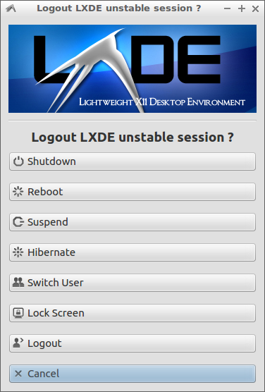

#####Examples directory
Each subdirectory here contains `bash` scripts which are separate projects but are collected here as all of them depend on the `dialogbox` application. All of them are written by the author of the `dialogbox` application and demonstrate technic of use and functionality of the latter. They can be used as examples. But they are fully functional GUI applications with minimum dependencies and desktop agnostic design.
#####Currently available projects
- `lxlogout-box` - minimalistic replacement for `lxsession-logout` (the default quit manager for `LXSession`)

- `su-box` - GUI frontend for `su` command. The main purpose is to run GUI applications with different user credentials. But it is also capable to run console applications within a terminal.

The author will add more applications here as soon as they are ready for release. They might not be included into the source tree of the latest release of the application. So, please always check the [examples directory in the repository](https://github.com/martynets/dialogbox/tree/master/examples) to get the latest examples.