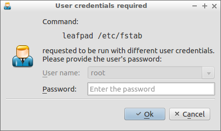
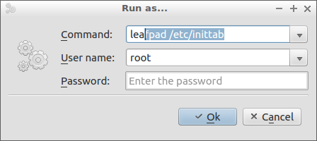

Copyright (C) 2015, 2016 Andriy Martynets [andy.martynets@gmail.com](mailto:andy.martynets@gmail.com)<br>
See the end of the file for [license conditions](#license).

-------------------------------------------------------------------------------

#### Introduction
`su-box` is the `bash` script which implements a GUI frontend for `su` command. The main purpose for it is to run a GUI application with different user credentials. But the script is also capable to run a console tool within current terminal if any.
The script is absolutely desktop agnostic and can be used on systems completely free from any GNOME, KDE, etc. stuff.
If target command is provided on command line the script asks only password for the requested user (root by default) and its dialog looks similar to the following depending on your current theme:



If the command is not provided it will be also asked for and the script's dialog looks similar to the following:



#### Software requirements
`su-box` script depends on the following software packages:
- the `bash` version 4.0+
- the `su` utility (`login` package)
- the `dialogbox` application (can be downloaded from [the dialogbox repository](https://github.com/martynets/dialogbox))
- the `execpty` tool (can be downloaded from [the execpty repository](https://github.com/martynets/execpty))
- optionally, the script uses [xdg-bash-functions package](https://github.com/martynets/xdg-bash-functions), if the last one present, for operations with current icon theme.

This software is shipped with the `installer` script which is designed for Debian derivatives and is based on the "Debian package management system". In particular it uses tools from `dpkg` and `apt` packages. With minor manual alterations it can be adapted for other systems.

#### Downloading
This script is shipped as an example for [the dialogbox application](https://github.com/martynets/dialogbox/) and can be downloaded from its repository.

#### Installation
This script doesn't require a specific installation and can be called from any location. It is advised to install it in `/usr/bin` directory.

The `installer` script present in the current directory provides user friendly GUI interface to installation tasks. It downloads and installs dependencies such as the [dialogbox application](https://github.com/martynets/dialogbox/), the [execpty tool](https://github.com/martynets/execpty/) and the  [xdg-bash-functions package](https://github.com/martynets/xdg-bash-functions/) as well as the target script.

All these tasks require root privilages. The installer tries to re-run itself with prompt for root password or asks user to run it with root account.

> Note: the `installer` script must be run from the source tree as it uses some shared files.

To uninstall the script the above tasks must be undone manually.

#### Usage
The `su-box` script recognizes several command line options. The command line syntax is the following:
```
su-box [-t|--terminal] [-u|--user USERNAME] [-c|--command] [COMMAND]
su-box -h|--help
su-box -v|--version
```
The below options are recognized. The first unrecognized option starts the command to execute and its arguments.

|Option        |Action                                             |
|--------------|---------------------------------------------------|
|-h, --help    |display brief usage information and exit           |
|-v, --version |display version information and exit               |
|-t, --terminal|allow the command to interact with current terminal|
|-u, --user    |specify the USERNAME to run as (root by default)   |
|-c, --command |specify COMMAND and its arguments to run           |

The main purpose of the `su-box` script is to run GUI applications or automated scripts which don't interact with a terminal. If, for some reason, there is a need to use it to run a program which inputs and/or outputs using current terminal the `--terminal` option can be used. This adds extra subshell and isn't the default behavior of the script.

The `--user` option defines the next argument as the desired username to run the command as. If it is omitted the `root` is assumed.

The `--command` option starts the target command and list of its arguments as the rest of the command line. This option can be omitted as anything not recognized is treated as the target command.

If the command to run is missed it is asked for in the dialog. The username is also available for editing in this case. Otherwise the password field is the only available for entering. See screenshots above.

##### Values of exit status mean the following:
- 0 - success (`--help` or `--version` only)
- 1	- authentication failure (derived from `su`)
- 127 - failure (with corresponding error message)
- 128 - the user cancelled operation
- Values greater than 128 - the command is terminated by a signal. The value is the signal number plus 128
- None of the above cases (successful command execution) - exit status of the command executed

#### Bug Reporting
You can send `su-box` bug reports and/or any compatibility issues directly to the author [andy.martynets@gmail.com](mailto:andy.martynets@gmail.com).

You can also use the online bug tracking system in the GitHub `dialogbox` project to submit new problem reports or search for existing ones:

  https://github.com/martynets/dialogbox/issues

#### Change Log
|Publication Date|Version|Comments                                 |
|----------------|-------|-----------------------------------------|
|Feb 29, 2016    |1.1    |Command and user name fields made comboboxes populated from commands history and `/etc/passwd` files respectively|
|Nov 28, 2015    |1.0    |Initial released version                 |

#### License
Copyright (C) 2015, 2016 Andriy Martynets [andy.martynets@gmail.com](mailto:andy.martynets@gmail.com)<br>
This file is part of `su-box`.

`su-box` is free software; you can redistribute it and/or modify it under the terms of the GNU General Public License as published by the Free Software Foundation; either version 3 of the License, or (at your option) any later version.

`su-box` is distributed in the hope that it will be useful, but WITHOUT ANY WARRANTY; without even the implied warranty of MERCHANTABILITY or FITNESS FOR A PARTICULAR PURPOSE.  See the GNU General Public License for more details.

You should have received a copy of the GNU General Public License along with
`su-box`.  If not, see <http://www.gnu.org/licenses/>.
